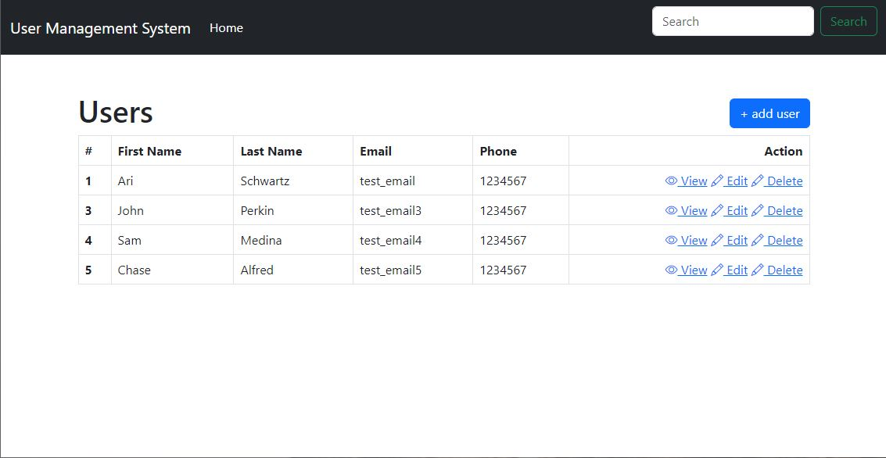

# E-commerce Back-End 

## Description:

&nbsp; The back-end is designed to help users manage an online store by providing a database to keep track of products, categories, and tags. Users can create, read, update, and delete (CRUD) products in the database, along with associated categories and tags. For example, if a user wants to add a new product to their online store, they can use the app to create a new product entry and assign it to a category, such as "electronics" or "home goods". They can also add tags to the product, such as "smart" or "energy-efficient", to help customers find what they're looking for.

The back-end works by using the Sequelize ORM library to interact with a MySQL database. The database schema is defined using models, which are JavaScript classes that extend Sequelize's Model class. Each model represents a table in the database and defines the fields and associations between tables. It also provides a RESTful API using Express.js, which allows clients to interact with the database by sending HTTP requests. The API routes handle CRUD operations for each model and return JSON responses to clients. With the app, managing an online store has never been easier!

## User Story

AS A manager at an internet retail company
I WANT a back end for my e-commerce website that uses the latest technologies
SO THAT my company can compete with other e-commerce companies

## Table of Contents:

- [Installation](#installation)
- [Usage](#usage)
- [Tests](#tests)
- [Badges](#badges)
- [How_to_Contribute](#how_to_contribute)
- [Questions](#questions)
- [License](#license)

## Installation:

1. Start by opening a terminal or command prompt and navigating to the directory where the code is located.<br>
2. Run 'npm i' install to install the required packages.<br>

```
npm i
```

3. Save the required information into a .env file saved in the root directory:

```
DB_HOST="________"
DB_USER="_________"
DB_PASSWORD="________"
DB_NAME="ecommerce_db"
```

4. Enter the command below to be prompted for your password to log in to the MySQL server.

```
mysql -u root -p
```

5. Run the following commands to create the database and seed with values.

```
source db/schema.sql
source db/seeds.sql
```

## Usage:

&nbsp; The website can be found at: https://github.com/arishorts/SQL-Employee-Tracker <br>
&nbsp; A video demonstration can be seen at: https://youtu.be/SrCVYcUd9RA



### Operation

This code is an application for managing store information in an SQL database. To use it, you need to have MySQL installed on your computer and have access to an SQL server.<br>

1. After the packages are installed, run the command node server.js to start the server.<br>
2. Install Insomnia and write CRUD commands to the API routes called in the documentation.<br>
3. To exit, press Ctrl+C in the terminal/command prompt and close Insomnia.<br>

## Tests:

&nbsp; None

## Badges:


## How_to_Contribute:

&nbsp; If you would like to contribute, refer to the [Contributor Covenant](https://www.contributor-covenant.org/)

## Questions:

&nbsp; My GitHub profile can be found at: https://github.com/arishorts
<br>&nbsp; Reach me with additional questions at : arieljschwartz@gmail.com

## License:

&nbsp; http://choosealicense.com/licenses/mit/

---

© 2022 Ariel Schwartz LLC. Confidential and Proprietary. All Rights Reserved.
